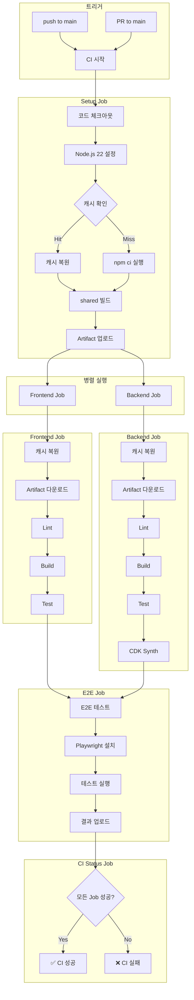
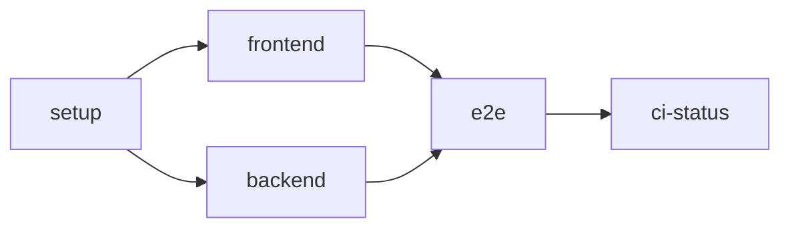
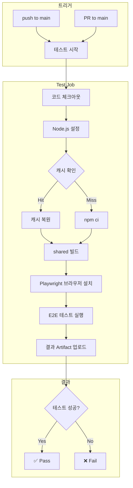
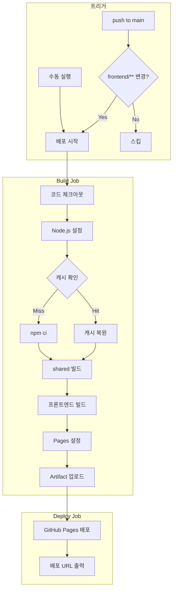
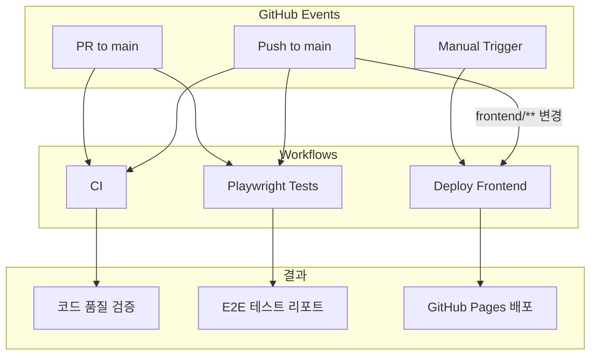
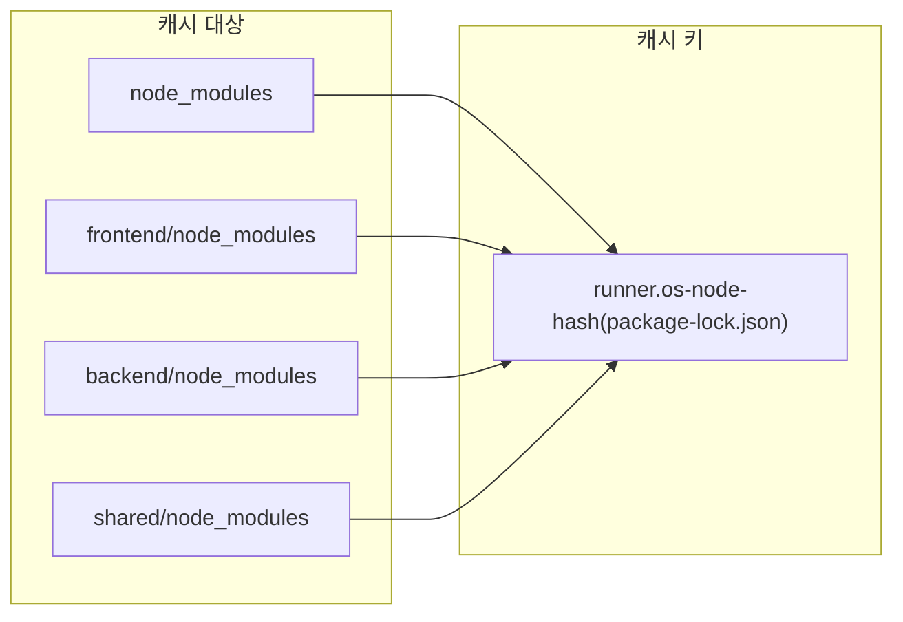
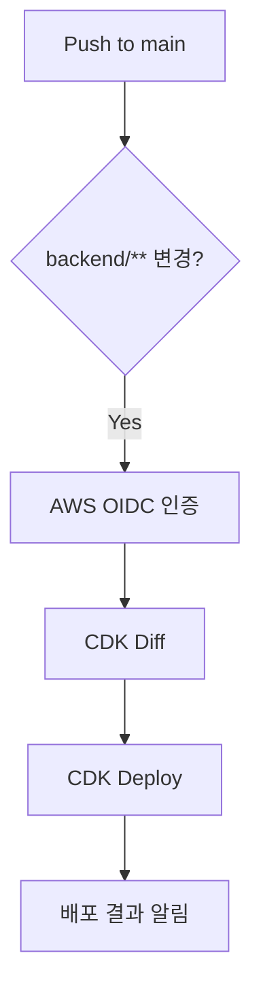

# CI/CD 파이프라인 설계

GitHub Actions 기반의 CI/CD 파이프라인 설계 문서입니다.

## 개요

본 프로젝트는 GitHub Actions를 사용하여 지속적 통합(CI) 및 지속적 배포(CD)를 자동화합니다.

### 워크플로우 구성

| 워크플로우 | 파일 | 트리거 | 목적 |
|-----------|------|--------|------|
| CI | `ci.yml` | push/PR to main | 코드 품질 검증 |
| Playwright Tests | `playwright.yml` | push/PR to main | E2E 테스트 |
| 프론트엔드 배포 | `deploy-frontend.yml` | push to main (frontend/**) | GitHub Pages 배포 |

---

## 1. CI 파이프라인 (ci.yml)

통합 CI 파이프라인으로 린트, 빌드, 테스트, CDK synth를 수행합니다.

### 1.1 파이프라인 흐름도

### 1.2 Job 의존성 다이어그램

### 1.3 주요 최적화

- **Concurrency**: 동일 브랜치의 중복 실행 자동 취소
- **캐시**: `node_modules` 캐시로 설치 시간 단축
- **Artifact**: shared 빌드 결과물 공유로 중복 빌드 방지
- **병렬 실행**: Frontend/Backend Job 동시 실행

### 1.4 Job 상세

| Job | 의존성 | 주요 작업 |
|-----|--------|----------|
| setup | - | 의존성 설치, shared 빌드 |
| frontend | setup | lint, build, test |
| backend | setup | lint, build, test, cdk synth |
| e2e | frontend, backend | Playwright 테스트 |
| ci-status | frontend, backend, e2e | 최종 상태 확인 |

---

## 2. Playwright 테스트 (playwright.yml)

독립적인 E2E 테스트 워크플로우입니다.

### 2.1 파이프라인 흐름도

### 2.2 테스트 구성

- **타임아웃**: 60분
- **브라우저**: Chromium, Firefox, WebKit (전체 설치)
- **테스트 파일**: `e2e/todo.spec.ts`
- **결과 보관**: 30일

---

## 3. 프론트엔드 배포 (deploy-frontend.yml)

GitHub Pages로 프론트엔드를 자동 배포합니다.

### 3.1 파이프라인 흐름도

### 3.2 배포 구성

- **환경**: github-pages
- **권한**: contents(read), pages(write), id-token(write)
- **Concurrency**: 동시 배포 방지 (cancel-in-progress: false)
- **트리거 경로**: `frontend/**`, `.github/workflows/deploy-frontend.yml`

---

## 4. 전체 워크플로우 관계

---

## 5. 캐싱 전략

### 5.1 캐시 구조

### 5.2 캐시 효과

| 시나리오 | 캐시 Hit | 예상 시간 절약 |
|----------|----------|---------------|
| 의존성 변경 없음 | ✅ | ~2-3분 |
| package-lock.json 변경 | ❌ | 0분 |

---

## 6. Branch Protection 연동

CI 워크플로우의 `ci-status` Job을 Branch Protection Rule의 필수 상태 체크로 설정합니다.

### 6.1 설정 방법

1. Repository Settings → Branches
2. main 브랜치 protection rule 추가
3. "Require status checks to pass" 활성화
4. `ci-status` 체크 추가

### 6.2 효과

- PR 머지 전 모든 CI 작업 통과 필수
- 코드 품질 게이트 역할

---

## 7. 향후 계획

### 7.1 백엔드 CD 파이프라인 (예정)

### 7.2 추가 예정 기능

- [ ] 테스트 커버리지 리포트
- [ ] 배포 알림 (Slack/Discord)
- [ ] Dependabot 자동 업데이트
- [ ] PR/Issue 템플릿

---

## 참고

- [GitHub Actions 문서](https://docs.github.com/en/actions)
- [Playwright 문서](https://playwright.dev/)
- [GitHub Pages 문서](https://docs.github.com/en/pages)
