# 개발 워크플로우

프로젝트의 전체 개발 프로세스와 작업 흐름을 정의합니다.

---

## 1. 전체 워크플로우 개요

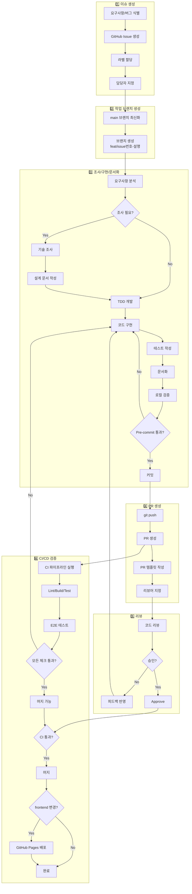

---

## 2. Phase 1: 이슈 생성

### 2.1 이슈 생성 프로세스

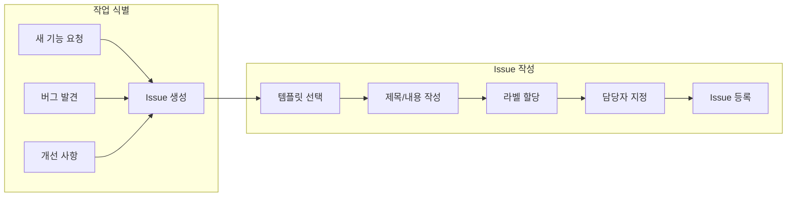

### 2.2 라벨 체계

| 카테고리 | 라벨 | 설명 | 색상 |
|---------|------|------|------|
| **Type** | `type:feat` | 새로운 기능 | 🟢 |
| | `type:fix` | 버그 수정 | 🔴 |
| | `type:docs` | 문서 변경 | 🔵 |
| | `type:refactor` | 리팩토링 | 🟡 |
| | `type:test` | 테스트 | 🟣 |
| | `type:chore` | 빌드/설정 | ⚫ |
| **Scope** | `scope:frontend` | 프론트엔드 | 🎨 |
| | `scope:backend` | 백엔드 | ⚙️ |
| | `scope:shared` | 공유 모듈 | 📦 |
| | `scope:infra` | 인프라/DevOps | 🔧 |
| **Priority** | `priority:high` | 높음 | 🔴 |
| | `priority:medium` | 중간 | 🟡 |
| | `priority:low` | 낮음 | 🟢 |

### 2.3 Issue 상태 흐름

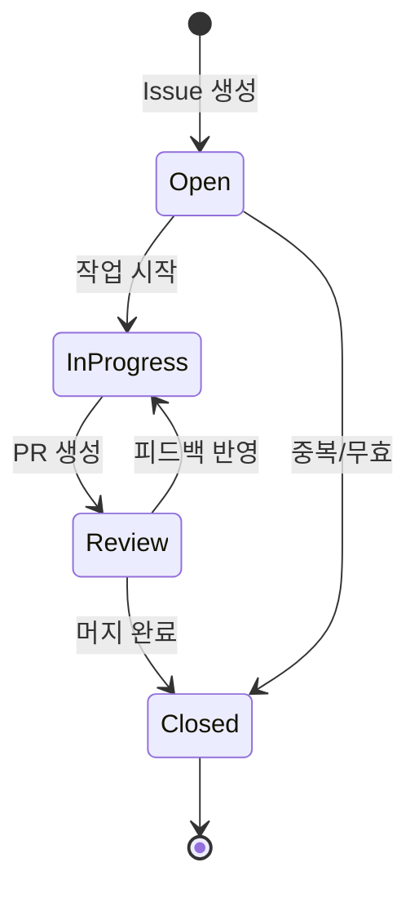

---

## 3. Phase 2: 작업 브랜치 생성

### 3.1 브랜치 생성 흐름

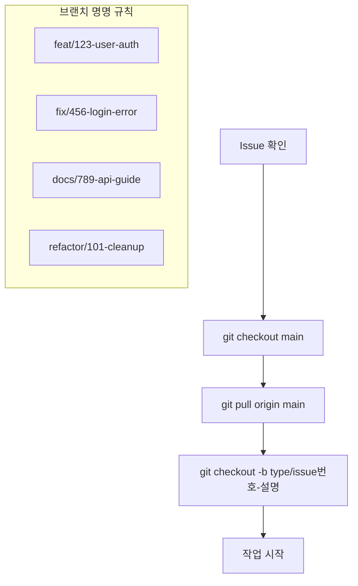

### 3.2 브랜치 전략

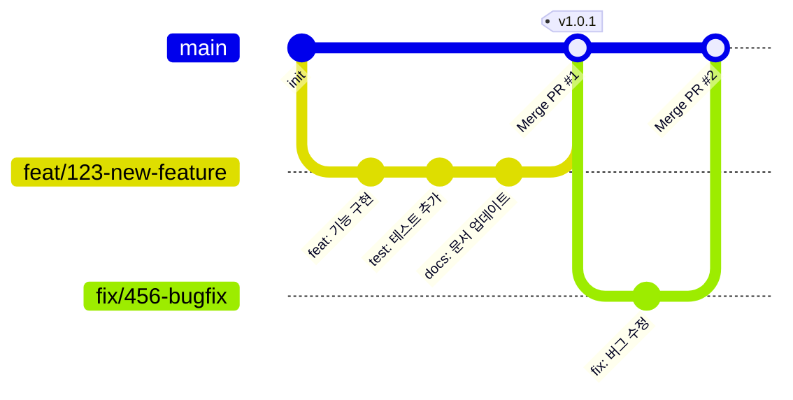

### 3.3 브랜치 명명 규칙

```
<type>/<issue-number>-<설명>
```

| 타입 | 예시 | 용도 |
|------|------|------|
| `feat` | `feat/123-user-auth` | 새 기능 개발 |
| `fix` | `fix/456-login-error` | 버그 수정 |
| `refactor` | `refactor/789-todo-context` | 리팩토링 |
| `docs` | `docs/101-api-guide` | 문서 작업 |
| `chore` | `chore/102-ci-setup` | 빌드/설정 |
| `hotfix` | `hotfix/999-critical` | 긴급 수정 |

---

## 4. Phase 3: 조사/구현/문서화

### 4.1 개발 사이클

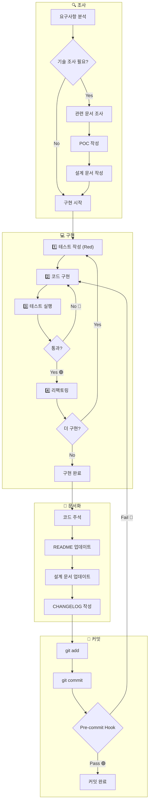

### 4.2 Pre-commit Hook 동작

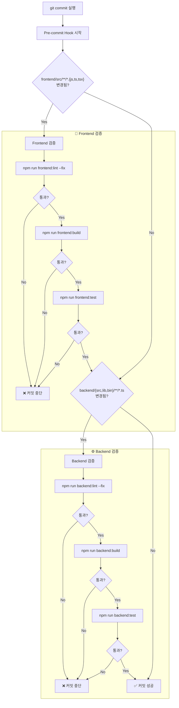

### 4.3 커밋 메시지 컨벤션

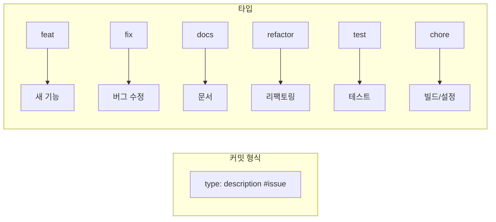

**예시:**
```bash
feat: Todo 필터링 기능 추가 #123

- 전체/완료/미완료 필터 구현
- 필터 상태 LocalStorage 저장
```

---

## 5. Phase 4: PR 생성

### 5.1 PR 생성 프로세스

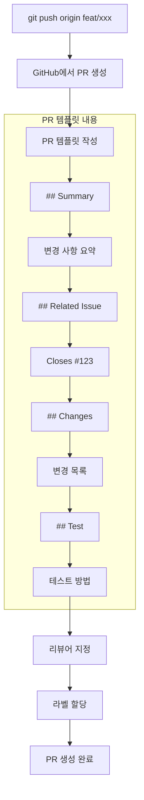

### 5.2 PR 상태 흐름

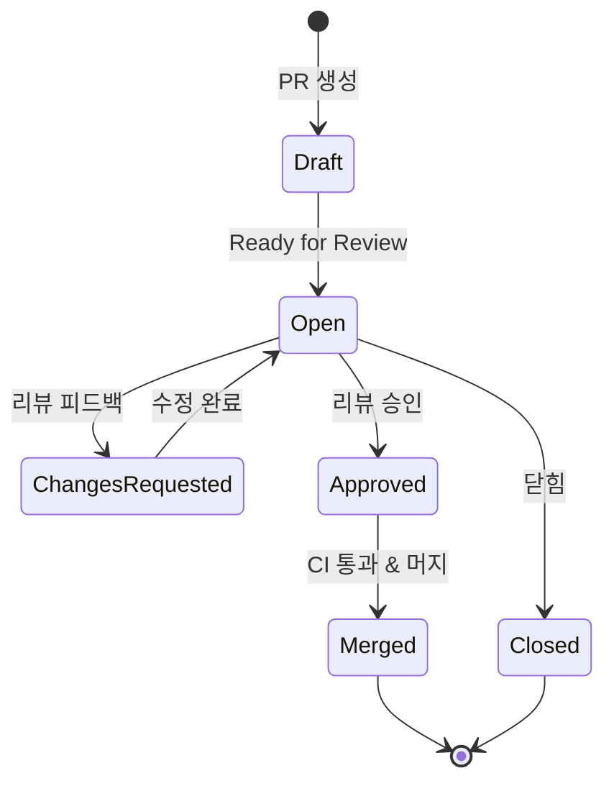

---

## 6. Phase 5: 코드 리뷰

### 6.1 리뷰 프로세스

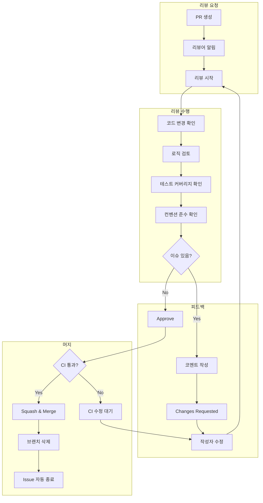

### 6.2 리뷰 체크리스트

- [ ] 코드가 요구사항을 충족하는가?
- [ ] 테스트가 충분한가?
- [ ] 코딩 컨벤션을 준수하는가?
- [ ] 성능 이슈는 없는가?
- [ ] 보안 취약점은 없는가?
- [ ] 문서가 업데이트되었는가?

---

## 7. Phase 6: CI/CD 검증

### 7.1 CI 파이프라인 전체 흐름

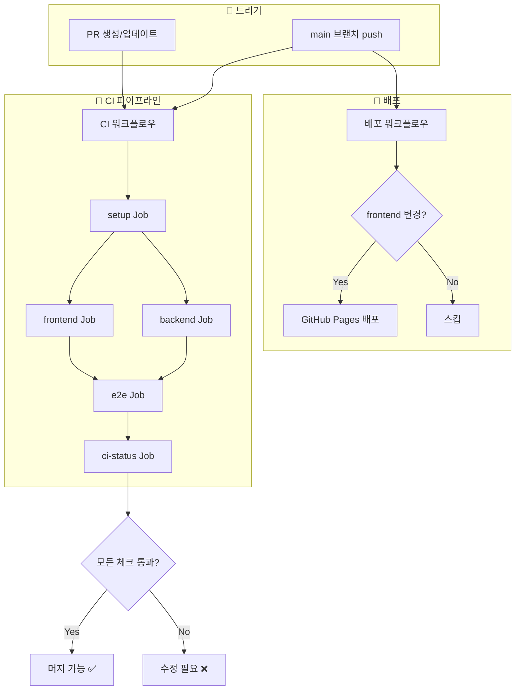

### 7.2 CI Job 상세

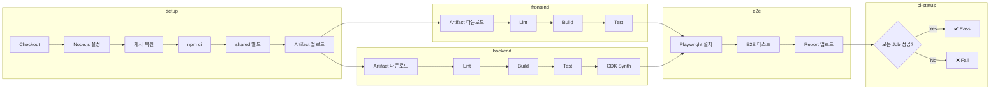

### 7.3 CI/CD 검증 체크포인트

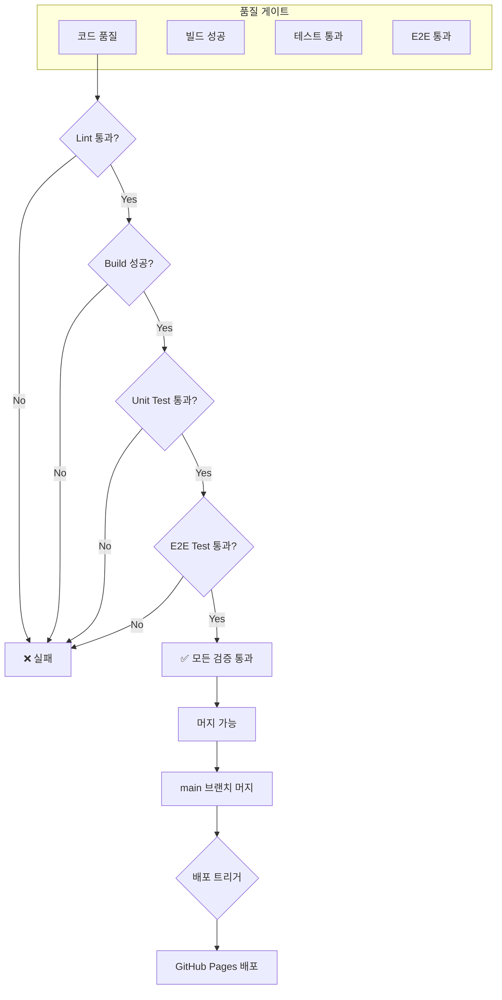

---

## 8. 전체 시퀀스 다이어그램

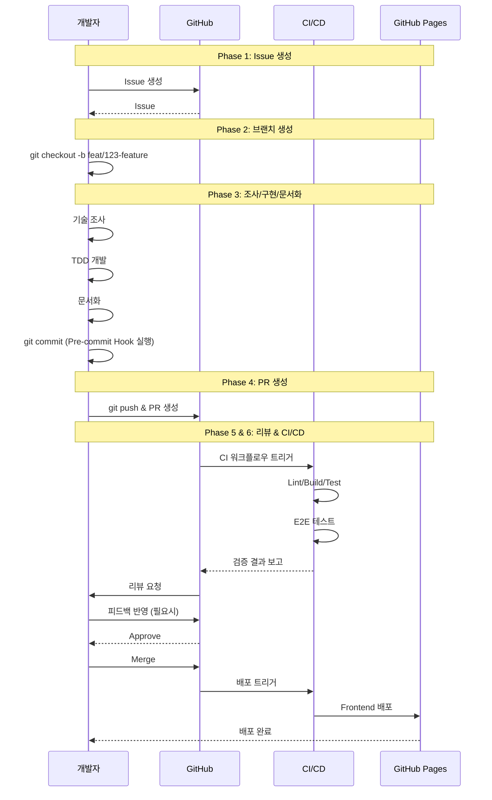

---

## 9. 일일 개발 루틴

### 시작

```bash
# 1. Issue 확인
gh issue view 123

# 2. main 브랜치 최신화
git checkout main
git pull origin main

# 3. 작업 브랜치 생성
git checkout -b feat/123-feature-name

# 4. shared 빌드 (의존성 변경 시)
npm run shared:build
```

### 개발 중

```bash
# 개발 서버 실행
npm run frontend:dev

# 테스트 실행
npm run frontend:test
npm run backend:test

# 타입 체크
npm run frontend:build
npm run backend:build
```

### 커밋 & PR

```bash
# 커밋 (pre-commit hook 자동 실행)
git add .
git commit -m "feat: 기능 설명 #123"

# 푸시
git push origin feat/123-feature-name

# PR 생성
gh pr create --title "feat: 기능 설명" --body "Closes #123"
```

### 리뷰 후

```bash
# 피드백 반영 후 재푸시
git add .
git commit -m "fix: 리뷰 피드백 반영"
git push origin feat/123-feature-name

# 머지 후 로컬 정리
git checkout main
git pull origin main
git branch -d feat/123-feature-name
```

---

## 참고

- [CI/CD 설계](ci-cd.md) - GitHub Actions 워크플로우 상세
- [CLAUDE.md](../../CLAUDE.md) - 프로젝트 규칙 및 컨벤션
