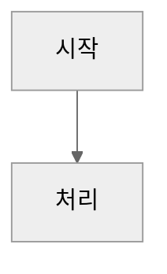

# 트러블슈팅 가이드

> 이 문서는 프로젝트에서 자주 발생하는 문제와 해결 방법을 정리한 가이드입니다.
>
> **마지막 업데이트**: 2025-11-30

---

## 목차

1. [AWS CDK 관련](#1-aws-cdk-관련)
2. [Jest 테스트 관련](#2-jest-테스트-관련)
3. [GitHub Actions CI/CD 관련](#3-github-actions-cicd-관련)
4. [Mermaid 다이어그램 관련](#4-mermaid-다이어그램-관련)
5. [Pre-commit Hook 관련](#5-pre-commit-hook-관련)
6. [모노레포 의존성 관련](#6-모노레포-의존성-관련)

---

## 1. AWS CDK 관련

### 1.1 REST API doesn't contain any methods

**증상**
```
Error: The REST API doesn't contain any methods
```

**원인**
CDK에서 API Gateway RestApi를 생성할 때 최소 하나 이상의 메서드가 필요합니다. 테스트 코드에서 Mock API를 생성할 때 발생합니다.

**해결 방법**
```typescript
const api = new apigateway.RestApi(stack, 'TestApi', {
  restApiName: 'Test API',
});

// 최소 하나의 메서드 추가
api.root.addMethod('GET', new apigateway.MockIntegration());
```

### 1.2 Duplicate stack ID 오류

**증상**
```
There is already a Construct with name 'StackName' in Stack
```

**원인**
Jest의 `beforeEach`에서 동일한 CDK App 인스턴스를 재사용하면서 같은 이름의 스택을 여러 번 생성하려고 할 때 발생합니다.

**해결 방법**
`beforeEach` 대신 팩토리 함수를 사용하여 각 테스트마다 새로운 리소스를 생성합니다.

```typescript
// ❌ 잘못된 예
let app: cdk.App;
beforeEach(() => {
  app = new cdk.App();
});

// ✅ 올바른 예
function createTestResources() {
  const app = new cdk.App();
  const stack = new cdk.Stack(app, 'TestStack');
  // ... 리소스 생성
  return { app, stack, /* ... */ };
}

it('should work', () => {
  const { app, stack } = createTestResources();
  // 테스트 코드
});
```

### 1.3 API Gateway 메트릭 dimension 하드코딩 문제

**증상**
CloudWatch 대시보드에서 API Gateway 메트릭이 수집되지 않음

**원인**
API 이름을 하드코딩하면 실제 배포된 API 이름과 불일치할 수 있습니다.

**해결 방법**
```typescript
// ❌ 잘못된 예
dimensionsMap: {
  ApiName: 'Todo App API',  // 하드코딩
}

// ✅ 올바른 예
const apiName = api.restApiName;  // 동적 참조
dimensionsMap: {
  ApiName: apiName,
}
```

---

## 2. Jest 테스트 관련

### 2.1 Jest가 E2E 테스트 폴더를 실행하려고 함

**증상**
```
Cannot find module '@playwright/test'
```

**원인**
Jest가 `e2e/` 폴더 내의 Playwright 테스트 파일을 실행하려고 시도합니다.

**해결 방법**
`jest.config.js`에서 E2E 폴더를 제외합니다.

```javascript
module.exports = {
  // ...
  testPathIgnorePatterns: [
    '/node_modules/',
    '/e2e/',  // E2E 테스트 폴더 제외
  ],
};
```

### 2.2 ts-jest config deprecated 경고

**증상**
```
ts-jest[ts-jest-transformer] (WARN) Define `ts-jest` config under `globals` is deprecated.
```

**원인**
ts-jest의 새로운 설정 방식으로 마이그레이션이 필요합니다.

**해결 방법**
```javascript
// ❌ 이전 방식
module.exports = {
  globals: {
    'ts-jest': {
      tsconfig: 'tsconfig.json',
    },
  },
};

// ✅ 새로운 방식
module.exports = {
  transform: {
    '^.+\\.tsx?$': ['ts-jest', {
      tsconfig: 'tsconfig.json',
    }],
  },
};
```

---

## 3. GitHub Actions CI/CD 관련

### 3.1 Branch Protection 상태 체크 실패

**증상**
PR에서 "Required status check is expected" 오류

**원인**
CI 워크플로우에서 상태 체크용 job이 누락되었거나 이름이 일치하지 않습니다.

**해결 방법**
CI 워크플로우에 상태 체크용 job을 추가합니다.

```yaml
ci-status:
  name: CI Status
  needs: [frontend, backend, e2e]
  runs-on: ubuntu-latest
  if: always()
  steps:
    - name: Check CI Status
      run: |
        if [[ "${{ needs.frontend.result }}" == "failure" ]] || \
           [[ "${{ needs.backend.result }}" == "failure" ]] || \
           [[ "${{ needs.e2e.result }}" == "failure" ]]; then
          echo "CI failed"
          exit 1
        fi
        echo "CI passed"
```

### 3.2 npm 캐시가 효과적으로 작동하지 않음

**증상**
CI에서 매번 의존성을 새로 설치함

**해결 방법**
```yaml
- uses: actions/setup-node@v4
  with:
    node-version: '22'
    cache: 'npm'
    cache-dependency-path: '**/package-lock.json'
```

---

## 4. Mermaid 다이어그램 관련

### 4.1 다크 모드에서 다이어그램이 보이지 않음

**증상**
GitHub의 다크 모드에서 Mermaid 다이어그램 텍스트가 읽히지 않음

**원인**
색상이 하드코딩되어 있거나 테마가 설정되지 않음

**해결 방법**
다이어그램 시작 부분에 neutral 테마를 설정합니다.

```markdown


**피해야 할 패턴**
```markdown
<!-- ❌ 잘못된 예 -->
style A fill:#ffffff,stroke:#000000
style B fill:#1a1a1a,color:#ffffff

<!-- ✅ 올바른 예 - 기본 스타일 유지 -->
A[노드] --> B[노드]
```

---

## 5. Pre-commit Hook 관련

### 5.1 커밋이 차단되는 경우

**증상**
```
[ERROR] 프론트엔드/백엔드 lint/build/test 실패
```

**원인**
pre-commit hook이 코드 품질 검사를 실행하며, 실패 시 커밋을 차단합니다.

**해결 방법**
1. 오류 메시지를 확인하고 문제를 수정
2. lint 오류의 경우: `npm run frontend:lint -- --fix` 또는 `npm run backend:lint -- --fix`
3. 테스트 실패의 경우: 테스트를 수정

**주의**: `--no-verify` 플래그 사용 금지 (프로젝트 규칙)

### 5.2 Hook이 불필요하게 실행되는 경우

**증상**
문서만 수정했는데 lint/build/test가 실행됨

**원인**
현재 hook은 `frontend/src/**/*.{js,ts,tsx}` 또는 `backend/{src,lib,bin}/**/*.ts` 변경 시에만 실행됩니다.

**확인 방법**
```bash
git diff --cached --name-only
```

---

## 6. 모노레포 의존성 관련

### 6.1 shared 모듈 타입 변경 후 빌드 실패

**증상**
```
Cannot find module '@vibecoding-demo/shared' or its type declarations
```

**원인**
shared 모듈의 타입을 변경한 후 빌드하지 않음

**해결 방법**
```bash
# shared 모듈 먼저 빌드
npm run shared:build

# 그 후 frontend/backend 빌드
npm run frontend:build
npm run backend:build
```

### 6.2 npm 워크스페이스 의존성 설치 문제

**증상**
```
npm ERR! Could not resolve dependency
```

**해결 방법**
```bash
# 루트에서 전체 의존성 재설치
rm -rf node_modules
rm -rf frontend/node_modules
rm -rf backend/node_modules
rm -rf shared/node_modules
npm install
```

---

## 문서 업데이트 가이드

이 문서에 새로운 트러블슈팅 사례를 추가할 때:

1. 적절한 섹션에 추가하거나 새 섹션 생성
2. 다음 형식을 따름:
   - **증상**: 오류 메시지 또는 문제 상황
   - **원인**: 문제의 근본 원인
   - **해결 방법**: 구체적인 해결 단계 (코드 예시 포함)
3. 문서 상단의 **마지막 업데이트** 날짜 갱신
4. 목차에 새 항목 추가
